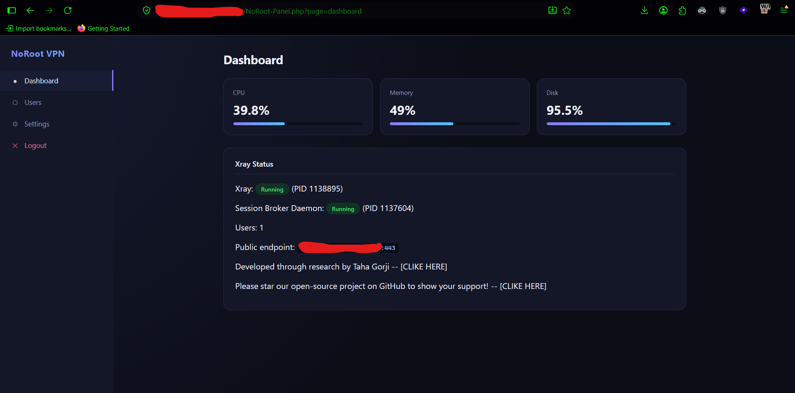
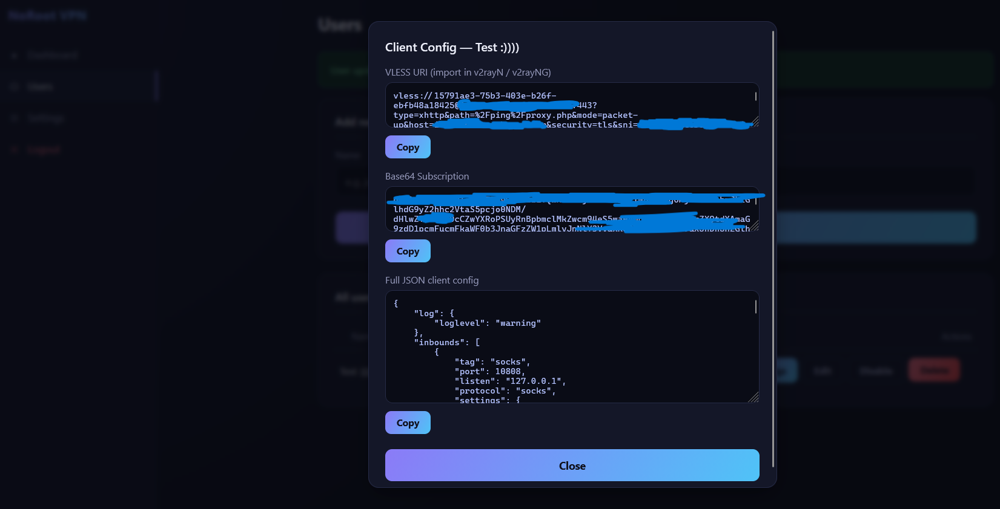
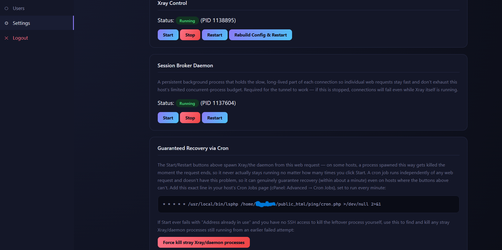
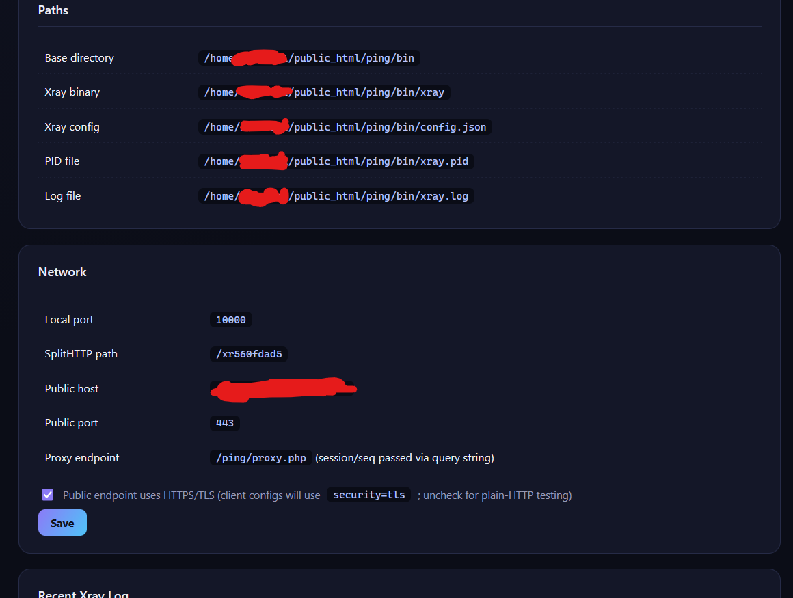
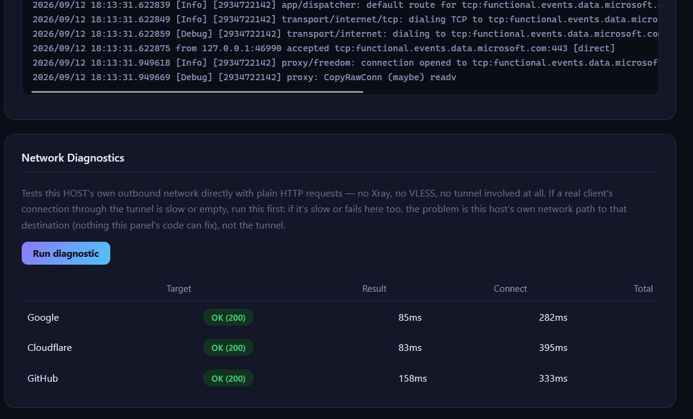
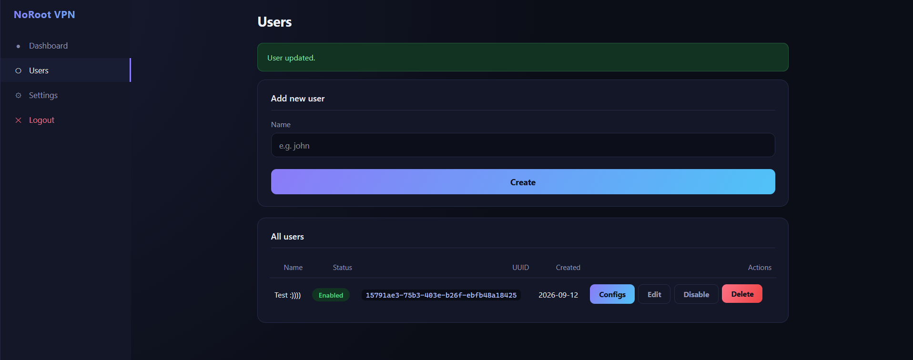
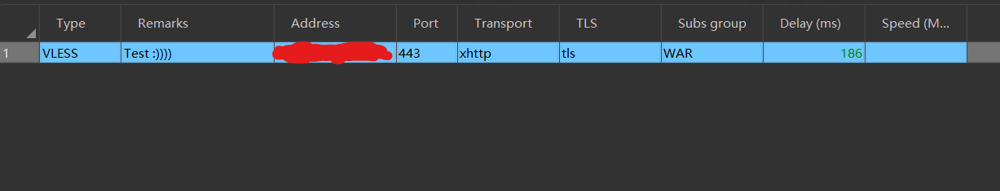

# NoRoot VPN Panel

A self-installing VLESS/XHTTP VPN panel that runs **entirely in PHP**, with no SSH, no root, and no ability to bind a raw public port — built for ordinary cPanel-style shared hosting.

[فارسی ↓](#پنل-vpn-بدون-روت)

---
> **Disclaimer / سلب مسئولیت / 免责声明 / Отказ от ответственности**
>
> 🇬🇧 **English:** This project is for research and educational purposes only. Use it only where permitted by the hosting provider and applicable laws. The developer is not responsible for misuse, policy violations, or legal consequences. [Read the full disclaimer](DISCLAIMER.md)
>
> 🇮🇷 **فارسی:** این پروژه صرفاً با اهداف پژوهشی و آموزشی ارائه شده است. استفاده از آن فقط در محیط‌های مجاز و مطابق قوانین و شرایط سرویس‌دهنده مجاز است. مسئولیت هرگونه استفاده نادرست، نقض قوانین یا عواقب حقوقی بر عهده کاربر است. [متن کامل سلب مسئولیت](DISCLAIMER.md)
>
> 🇨🇳 **中文：** 本项目仅用于研究和教育目的。请仅在主机服务商许可及符合适用法律的情况下使用。开发者不对滥用、违反服务条款或由此产生的法律后果负责。 [完整免责声明](DISCLAIMER.md)
>
> 🇷🇺 **Русский:** Проект предназначен исключительно для исследовательских и образовательных целей. Используйте его только там, где это разрешено хостинг-провайдером и действующим законодательством. Разработчик не несёт ответственности за неправомерное использование, нарушение правил или юридические последствия. [Полный отказ от ответственности](DISCLAIMER.md)

---

## Why this exists

Shared hosting is normally considered impossible territory for running a real VPN: no root, no arbitrary listening ports, a strict cap on concurrent processes, and often no SSH access at all. Every "VPN on shared hosting" approach we could find either needs a VPS, needs root, or is a thin wrapper that still assumes SSH.

This project instead:
- Downloads and runs a real **Xray-core** binary (the actual VLESS/xhttp engine — nothing here reimplements the protocol)
- Tunnels all of Xray's traffic through a single ordinary PHP endpoint (`proxy.php`) using the `xhttp` transport, so it never needs a bound public port — it looks like normal HTTP(S) traffic to the hosting stack
- Runs a lightweight persistent PHP daemon as the session broker, working around PHP's own worker-process limits with a long-poll design
- Self-heals: a background watchdog inside the daemon itself restarts Xray within seconds if it crashes, independent of any web request
- Falls back to a cron-based recovery path for hosts where a web-request-spawned process gets killed the instant the request ends
- Never needs `exec()`/`proc_open()` to be *usable* — only to be *self-managing*; without them, it still generates working configs and tells the admin the exact command to run by hand
### But Running a full and real(X-Ray) vpn without root access on normal php shared host was almost impossible

As far as we could find, no other publicly known project combines all of this into a single-click, root-less, SSH-less panel. If you know of one, we'd genuinely like to hear about it.

## Features

- One-file installer with a real environment check (not a checklist — it actually spawns a test process and downloads a test binary)
- Cross-platform: Linux and Windows hosts, auto-detected
- Per-user management: create, rename, disable/enable without deleting, regenerate a leaked UUID instantly
- VLESS config delivered as a URI, a base64 subscription link, and a full JSON client config
- Optional TLS toggle for testing on a plain-HTTP endpoint before going live
- Tuned for **stability on CPU/process-constrained hosts**: bounded memory per session, backpressure instead of unbounded buffering, fault isolation (one bad connection can't take down every other user), and a short-hold relay design so dozens of a page's resources can share a tiny worker budget instead of exhausting it


## Screenshots

<table>
  <tr>
    <td align="center"></td>
    <td align="center"></td>
  </tr>
  <tr>
    <td align="center"></td>
    <td align="center"></td>
  </tr>
  <tr>
    <td align="center"></td>
    <td align="center"></td>
  </tr>
  <tr>
    <td align="center"></td>
    <td></td>
  </tr>
</table>

### Image Links

* [DashBoard](images/DashBoard.png)
* [Get Configs](images/getconfigs.png)
* [Settings 1](images/settings1.png)
* [Settings 2](images/settings2.png)
* [Settings 3](images/settings3.png)
* [Users](images/users.png)
* [Usage](images/use.png)


## Requirements

- PHP 7.4+ with `curl` and `zip` extensions (both nearly universal on shared hosting)
- `exec()` or `proc_open()` *recommended* for self-managed start/stop/restart and the self-healing watchdog — not required to install or generate configs
- A cron job slot (cPanel: *Advanced → Cron Jobs*) is **strongly recommended** as a guaranteed recovery path; the panel shows you the exact line to add

## Install

1. Upload all files in this folder to your hosting account (e.g. `public_html/vpn/`)
2. Visit `NoRoot-Panel.php` in a browser — the install wizard walks you through the rest
3. On the Settings page after installing, copy the cron line shown under **Guaranteed Recovery via Cron** into your host's Cron Jobs panel
### The installation wizard may take anywhere from 5 to 10 minutes; please do not close the page and wait until you are automatically redirected to the admin panel.

## Architecture (short version)

```
Client (v2rayN / sing-box / v2rayNG)
   │  VLESS over xhttp, over plain HTTPS
   ▼
proxy.php  ──(long-poll)──▶  daemon.php  ──▶  Xray-core (127.0.0.1)
(one PHP worker per       (one persistent      (the actual VPN engine —
 in-flight request,        process, brokers     protocol correctness lives
 released quickly)         many sessions)       here, not in our PHP)
```

`proxy.php` never holds a PHP worker open longer than a few seconds — that's the single most important design decision for surviving a shared host's tiny process budget. `daemon.php` is the one process that's allowed to wait, because it's not counted against the same per-request worker pool.

## Troubleshooting on very restricted hosts

- **"Address already in use" on Start/Restart** — a leftover process from before is holding the port. Use *Force kill stray processes* on the Settings page (no SSH needed).
- **Xray won't stay running, log is empty or shows a Go runtime panic** — the account's process/thread limit (common on CloudLinux/LVE) is too tight for Xray's default thread pool; this is already mitigated (`GOMAXPROCS=1`) but very aggressive limits may still need the cron path instead of request-triggered starts.
- **A real page won't load / lots of failed requests** — this was the single biggest issue we found and fixed: every concurrent browser request needs its own short-lived PHP worker. If it's still failing under heavy concurrency, it's the account's process cap, not a bug — there's a hard physical limit to how much this can be worked around in pure PHP.


## Security Update
### You can see all Security Updates and Changes in [SECURITY_UPDATE.md](/SECURITY_UPDATE.md)
These changes are part of the project's ongoing security hardening and do not constitute a guarantee that the software is completely vulnerability-free.


## Security notes

- Rotate a user's UUID immediately if you suspect it leaked — the Edit dialog does this without deleting their history
- The panel deliberately never adds identifying headers (like `X-Forwarded-For`) to the traffic it relays, to avoid giving a censor an easy fingerprint
- Admin credentials are hashed (`password_hash`), and the config file is blocked from direct web access via `.htaccess`

---

<a name="پنل-vpn-بدون-روت"></a>
## پنل VPN بدون روت

یک پنل کاملاً خودنصب‌شوندهٔ VLESS/XHTTP که **صرفاً با PHP** کار می‌کند — بدون SSH، بدون روت، و بدون نیاز به باز کردن پورت عمومی خام. برای هاست‌های اشتراکی معمولی (cPanel و مشابه) ساخته شده.

### چرا این پروژه ساخته شد

هاست اشتراکی معمولاً محیط غیرممکنی برای اجرای یک VPN واقعی در نظر گرفته می‌شود: بدون روت، بدون پورت دلخواه، سقف سخت روی تعداد پروسه‌های هم‌زمان، و اغلب حتی بدون دسترسی SSH. تا جایی که جستجو کردیم، هیچ پروژهٔ شناخته‌شدهٔ دیگری که همهٔ این محدودیت‌ها را همزمان و به‌صورت یک پنل تک‌کلیکی، بدون روت، بدون SSH حل کند پیدا نکردیم. اگر پروژهٔ مشابهی می‌شناسید، خوشحال می‌شویم بدانیم.

این پروژه:
- باینری واقعی **Xray-core** را دانلود و اجرا می‌کند (موتور واقعی VLESS/xhttp — پروتکل در PHP بازسازی نشده)
- تمام ترافیک Xray را از یک اندپوینت PHP معمولی (`proxy.php`) با ترنسپورت `xhttp` تونل می‌کند، پس هیچ‌وقت نیاز به باز کردن پورت عمومی ندارد — از دید هاست، دقیقاً شبیه ترافیک HTTP(S) معمولی است
- یک daemon سبک و پایدار PHP به‌عنوان واسط session اجرا می‌کند که با طراحی long-poll، محدودیت تعداد پروسهٔ PHP هاست را دور می‌زند
- خودترمیم است: یک watchdog داخل خودِ daemon، اگر Xray کرش کند، ظرف چند ثانیه و کاملاً مستقل از هر درخواست وب آن را دوباره راه می‌اندازد
- برای هاست‌هایی که پروسهٔ ساخته‌شده از یک درخواست وب را بلافاصله بعد از پایان آن درخواست می‌کُشند، یک مسیر بازیابی مبتنی بر cron هم دارد
- برای *کار کردن* هیچ‌وقت به `exec()`/`proc_open()` نیاز ندارد — فقط برای *مدیریت خودکار* لازمشان دارد؛ بدون آن‌ها هم کانفیگ‌های واقعی و کاربردی می‌سازد و دستور دقیق اجرای دستی را به ادمین نشان می‌دهد

### قابلیت‌ها

- نصب‌کنندهٔ تک‌فایلی با چک محیط واقعی (نه یک چک‌لیست ظاهری — واقعاً یک پروسهٔ تست اجرا و یک باینری تست دانلود می‌کند)
- چندسکویی: هم لینوکس هم ویندوز، تشخیص خودکار
- مدیریت هر کاربر به‌صورت جدا: ساخت، تغییر نام، غیرفعال/فعال‌سازی بدون حذف، تولید فوری UUID جدید در صورت لو رفتن
- کانفیگ VLESS به سه شکل: لینک URI، لینک اشتراک base64، و کانفیگ کامل JSON
- سوییچ اختیاری TLS برای تست روی یک اندپوینت HTTP ساده قبل از رفتن به حالت واقعی
- تنظیم‌شده برای **پایداری روی هاست‌های محدود از نظر CPU/پروسه**: محدودیت حافظهٔ هر session، backpressure به‌جای بافر بی‌حد، ایزوله‌سازی خطا (یک اتصال خراب نمی‌تواند بقیهٔ کاربران را قطع کند)، و طراحی نگه‌داری کوتاه‌مدت اتصال تا ده‌ها درخواست هم‌زمان یک صفحه بتوانند از همان سهمیهٔ کوچک پروسه به‌نوبت استفاده کنند به‌جای اینکه فوراً تمامش کنند

### پیش‌نیازها

- PHP نسخهٔ ۷.۴ به بالا با اکستنشن‌های `curl` و `zip` (روی تقریباً همهٔ هاست‌های اشتراکی موجودند)
- `exec()` یا `proc_open()` *پیشنهاد می‌شود* برای استارت/استاپ/ری‌استارت خودکار و watchdog خودترمیم — برای نصب یا ساخت کانفیگ لازم نیست
- یک جای خالی برای cron job (در cPanel: مسیر Advanced ← Cron Jobs) **قویاً پیشنهاد می‌شود** به‌عنوان مسیر بازیابی تضمینی؛ پنل خودش خط دقیق لازم را نشان می‌دهد

### نصب

۱. تمام فایل‌های این پوشه را در اکانت هاستینگ خود آپلود کنید (مثلاً `public_html/vpn/`)
۲. آدرس `NoRoot-Panel.php` را در مرورگر باز کنید — ویزارد نصب بقیهٔ مراحل را طی می‌کند
۳. بعد از نصب، از صفحهٔ Settings، خط cron نمایش‌داده‌شده زیر عنوان **Guaranteed Recovery via Cron** را کپی کرده و در بخش Cron Jobs هاست خودتان اضافه کنید

### هنگام نصب ویزارد مممکنه حتی 5 تا 10 دقیقه زمان ببره لطفا صفحه رو اصلا نبندید و انقدر صبر کنید تا خودکار وارد پنل ادمین بشید

### رفع اشکال روی هاست‌های بسیار محدود

- **خطای «Address already in use» هنگام Start/Restart** — یک پروسهٔ باقی‌مانده از قبل، پورت را گرفته است. از دکمهٔ *Force kill stray processes* در صفحهٔ Settings استفاده کنید (بدون نیاز به SSH)
- **Xray روشن نمی‌ماند، لاگ خالی است یا panic نشان می‌دهد** — سقف تعداد پروسه/thread اکانت (رایج در CloudLinux/LVE) برای thread pool پیش‌فرض Xray تنگ است؛ این مورد از قبل با `GOMAXPROCS=1` مدیریت شده، اما محدودیت‌های بسیار سخت‌گیرانه ممکن است همچنان به مسیر cron به‌جای استارت مبتنی‌بر درخواست نیاز داشته باشند
- **یک صفحهٔ معمولی باز نمی‌شود / درخواست‌های زیادی fail می‌شوند** — این بزرگ‌ترین مشکلی بود که پیدا و رفع کردیم: هر درخواست هم‌زمان مرورگر به یک پروسهٔ کوتاه‌مدت PHP نیاز دارد. اگر همچنان زیر بار زیاد fail می‌شود، این سقف پروسهٔ اکانت شماست نه یک باگ — یک محدودیت فیزیکی سخت وجود دارد که PHP خام نمی‌تواند کاملاً دورش بزند

## به‌روزرسانی امنیتی
### جزییات بروزرسانی های امنتی را در هر نسخه می توانید از [SECURITY_UPDATE.md](/SECURITY_UPDATE.md) مشاهده کنید
این تغییرات بخشی از فرایند مستمر سخت‌سازی امنیتی پروژه هستند و به‌معنای تضمین نبود کامل آسیب‌پذیری در نرم‌افزار نیستند.


### نکات امنیتی

- اگر گمان می‌کنید UUID یک کاربر لو رفته، فوراً از دیالوگ Edit آن را عوض کنید — بدون حذف تاریخچهٔ کاربر
- پنل عمداً هیچ‌وقت هدرهای شناسایی‌کننده (مثل `X-Forwarded-For`) را به ترافیک رله‌شده اضافه نمی‌کند، تا اثر انگشت آسانی برای سانسور باقی نگذارد
- رمز ادمین هش می‌شود (`password_hash`)، و فایل کانفیگ از طریق `.htaccess` در برابر دسترسی مستقیم وب محافظت می‌شود
